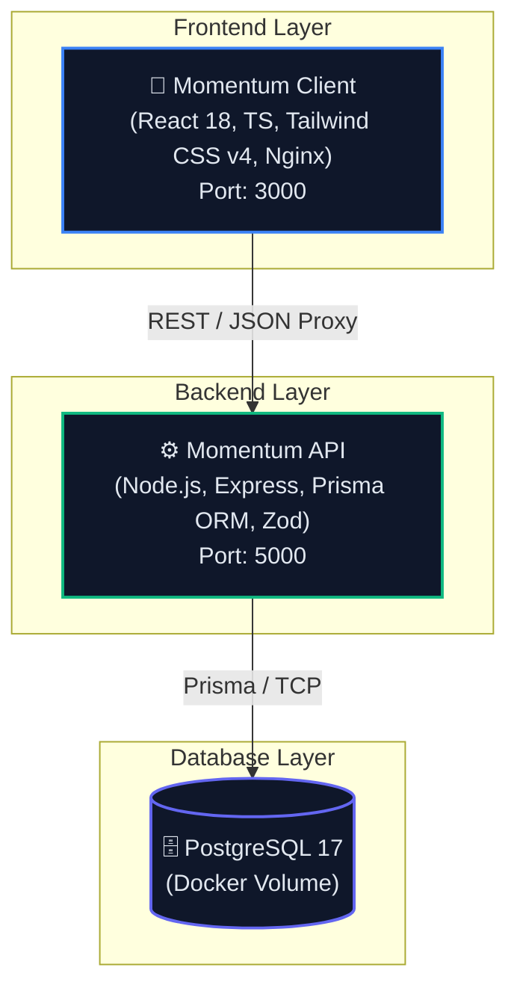

<div align="center">
  <h1>🚀 Momentum</h1>
  <p><strong>Intelligent Todo & Productivity Operating System</strong></p>
  
  <p>
    <a href="https://github.com/dakshsaini2/Momentum/stargazers"></a>
    <a href="https://github.com/dakshsaini2/Momentum/network/members"></a>
    <a href="https://github.com/dakshsaini2/Momentum/issues"></a>
    <a href="https://github.com/dakshsaini2/Momentum/blob/main/LICENSE"></a>
  </p>

  <p>
    
    
    
    
    
    
    
  </p>
  <p><em>"Stop managing tasks. Start making progress."</em></p>
</div>

Momentum is a full-stack, production-quality productivity platform designed to answer the core question: **"What should I work on right now, and why?"**

## 📑 Table of Contents

- [⚡ 1-Command Docker Quick Start](#-1-command-docker-quick-start)
- [🌟 Key Features](#-key-features)
- [🏗️ Architecture & Stack](#️-architecture--stack)
- [🛠️ Local Development (without Docker)](#️-local-development-without-docker)
- [🧪 Testing](#-testing)
- [🤝 Contributing](#-contributing)
- [👨‍💻 Author](#-author)
- [📄 License](#-license)

---

## ⚡ 1-Command Docker Quick Start

Run the entire platform (PostgreSQL + Express API + React Nginx Client) with **one single command**:

```bash
docker compose up --build
```

Access the application in your browser:
- 🌐 **Web Application**: [`http://localhost:3000`](http://localhost:3000)
- 🔌 **Backend REST API**: [`http://localhost:5000/api/health`](http://localhost:5000/api/health)

*(Demo login credentials: `demo@momentum.app` / `Password123!`)*

---

## 🌟 Key Features

1. **Momentum Engine (0–100 Score)**: Dynamic heuristic algorithm evaluating task priority, deadline proximity, sunk-cost progress inertia, inactivity penalties, and dependency lock states.
2. **"What's Next?" Recommendation Engine**: Recommends the single best task to focus on matching your current energy level (**High Energy ⚡**, **Medium Energy 🔋**, **Low Energy 🍃**).
3. **Quick Command Capture**: Natural language task parser supporting command syntax:
   `Finish API tomorrow 6pm #backend !high @Backend API ~45m`
4. **Distraction-Free Focus Mode**: Fullscreen countdown timer with Pomodoro controls, audio alerts, and post-focus reflection feedback (**😊 Easy**, **😐 Normal**, **😓 Difficult**, **🚫 Blocked**).
5. **Today's Focus Plan (`/today`)**: Morning planning breakdown into Focus Priorities, Quick Wins (≤ 15 mins), and Remaining Actions.
6. **Interactive Daily Planner & End-of-Day Review**: Time-blocked schedule setup and end-of-day summary wizard with carry-forward capability for incomplete tasks.
7. **Task Dependencies & Blocked Reasons**: Visual dependency mapping and explicit blocker resolution workflows.
8. **Subtask AI Breakdown**: Abstracted service interface for automated subtask generation.
9. **Recharts Productivity Analytics**: Visual trends for 7-day completion velocity, focus time distribution, task distribution by priority, and data-driven insights.
10. **Keyboard Shortcuts**: Full keyboard navigation (`N` for New Task, `⌘K` or `/` for Global Search, `D` for Dashboard, `T` for Today, `F` for Focus, `P` for Projects, `?` for Shortcuts cheat-sheet).

---

## 🏗️ Architecture & Stack



---

## 🛠️ Local Development (without Docker)

```bash
# 1. Start database in Docker
docker run --name momentum-postgres -e POSTGRES_USER=postgres -e POSTGRES_PASSWORD=postgrespassword -e POSTGRES_DB=momentum -p 5433:5432 -d postgres:17

# 2. Run backend
cd my-api
npm install
npm run db:push
npm run db:seed
npm run dev

# 3. Run frontend
cd ../client
npm install
npm run dev
```

---

## 🧪 Testing

```bash
cd my-api
npm test
```

---


## 👨‍💻 Author

**Devansh Saini**


